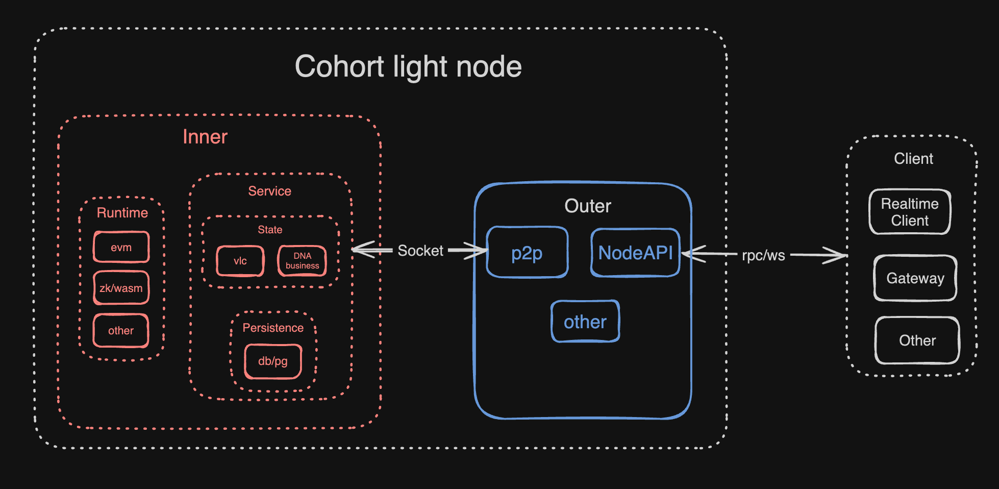

# ZEB Network

## Overview

Zeb network is a p2p relay network with verifiable logic clock. This network is currently in poc stage, and contains several components: p2p module, vlc module, gateway, browser, chat client.

## Arch overview

## Next

The following document will provide a detailed explanation of zeb from multiple perspectives.

- [modules](./modules.md)
- [vlc](./vlc.md)
- [usage](./usage.md)
- [api](./api.md)
- [benchmark](./benchmark.md)
