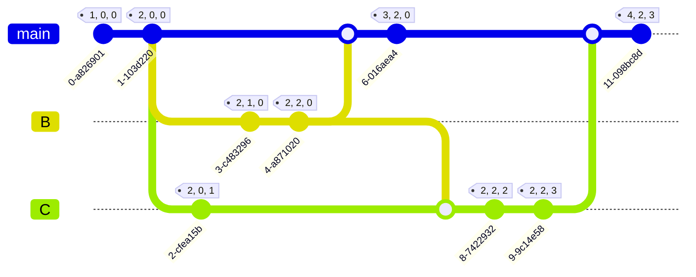
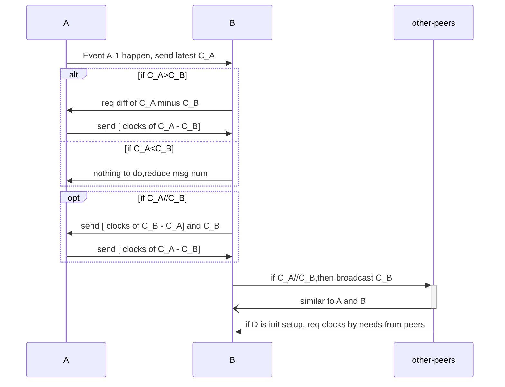

# Clock & p2p combined or **optimizing**

## Guideline & Principles

### Clock Self ( Reference COPS )

- L2 causality Replica group (similar Cohort, sub-network, or cluster, Maybe HLS certification)
  - 1、CohortClock needs to be still asynchronous to update a batch of Txs &  VLC in a cluster (DHT network).
  - 2、Merge by VLC-defined algorithm, communicate by gossip Algo. (small world servers
     cluster)
  - 3、Keep the size of the L2 causality network to prevent linear inflation of VLC space. (May need to change DHT or Bootstrap logic)
  - 4、runtime clock data pruning（when node online or offline）
  - 5、 A random select leader or conductor must exist for submitting Rollup-tx(ZKP IVC), and conductor clock in each L2 epoch timestamp.
- L1 main-chain Hubs for security gatekeepers, consistency, and tokenization value layer.
  - only accept cohort leader rollup tx and VLC data for a global up-to-date view of the entire network.

### P2P & VLC

- **SyncMessage**: VLC state & hash of a batch of tx needs to sync to peers
- VLC state ZKP & txs MKT needs submit to L1 Hub for validation & global causal state
- Adjust DHT, Bootstrap Algo parameters to Limit network scale and size

## Modeling & Data Structure

### Simple Modeling

Suppose there were `n` nodes in cohort network, n is three in below graph. It looks like below, when start node running.



### Data Structure

- Purpose
  - Display clock’s state & change in global view.
- Related data structure as below:
  - Message (Ref P2P Design) or Transaction
    - VLC: Verifiable logical clock
    - node_id
  - MergeLog as edge, ClockInfo as vertex.
    - main data structure for db saving and recovering the dag propagation graph about clocks.

```mermaid
classDiagram
    note for Message "Message or tx in network"
    note for MergeLog "Merging log save to db, as the edge"
    note for ClockInfo "ClockInfo save to db, as the vertex"
    
    Message <-- Clock
    MergeLog
    ClockInfo **<--** Clock
    Message: +vlc Clock
    Message: +isZK bool
    Message: +from/toAddr str
    Message: +signature str
    
    Clock: -value map（id, u128）
    class Clock {
	    -partial_cmp()
	    -inc()
	    -merge()
    }
    
    class ClockInfo {
	    ****-nodeID u128
	    -eventCount u128
	    **-**createAt ****u128
	    -Clock Clock
	    -messageId String
    }
    
    **class** MergeLog **{
	    -fromID u128
	    -toID u128
	    -startCount u128
	    -endCount u128
	    -startClockHash ClockHash
	    -afterClockHash ClockHash
	    -mergeAt u128
	    +serialize()
	    +deserialize()
    }**
    
```

### **Persistence & DB**

Clock data save to the KV db, LMDB for persistence for now.

Maybe the `postgreDB` or `influxDB` is a better choice for `next step`.

- **ClockInfo**
  - key:  `nodeid-count-vertex`,  value: `serde(ClockInfo)`
- **MergeLog**
  - key:  `fromid-fcount-toid-tcount-edge`,  value: `serde(MergeLog)`
- CurCount, not must
  - key: `nodeid`, value: `current_count`
- When needs to rebuild the dag of clock propagation,
  - first use ClockInfo node to construct participant event line,
  - then use MergeLog info for constructing the edge of the dag.

## State Increment Sync & Separate Clock

### Separate State & Clock

Because global data state is much big, so can’t gossip to other participants with so big data package. Separate full state and clock is must to do.

- But clock needs to reference transactions or message.
  - So `message_id` needs add to ClockInfo.

### State Increment Sync

There are two methods for state increment sync, make events organize to merkle tree or just the native vlc structure.

- 1、Event merkle tree
  - Transactions merkle tree in block header, just for light client quick verify.
    - whether there is a transaction block in our design ?  `not must`
  - World state MPT or merkle tree in memory
    - whether there is a world state tree in our design ?
      - Must be consensus algorithm & full transaction order.  `not must`
      - if not, it will cause state not consistency.

So, we accept `second method`, just use native vlc structure to sync state directly.

- 2、direct sync by vlc
  - first sync clock, then active pull diff events.
  - init setup, pull from many peers neighbor by needs in parallel.



- All message types:
  - ServerMsg:
    - EventTrigger
    - DiffReq
    - DiffRsp
    - ActiveSync
  - ClientMsg: only send latest clock
- Tips:
  - `C_A` refer to the latest clock of node A,  `C_B` : latest clock of node B.

### Ledger Organization Modes

Ledger mode is another important issue, this topic leaves to the `next step` to discuss or design.

- DAG ledger
  - DAG, not friendly to virtual-machine, and asset
- liner chain ledger
  - liner chain, not friendly scalability