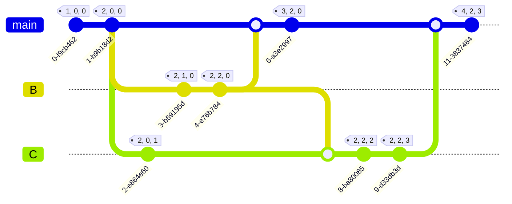
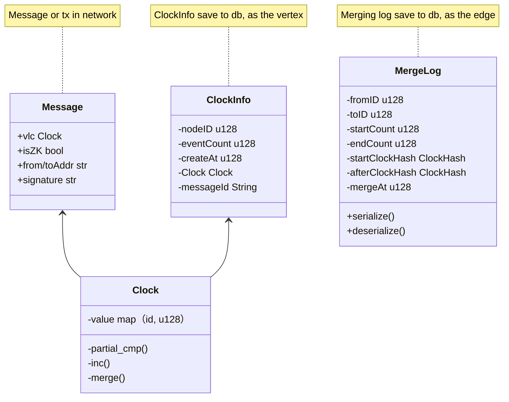

# Clock & p2p combined or **optimizing**

This document is used to discuss how clock or vlc can be combined or optimized with p2p protocols.

## Modeling & Data Structure

### Simple Modeling

Suppose there were `n` nodes in cohort network, n is three in below graph. It looks like below, when start node running.

### Data Structure

- Purpose
  - Display clock’s state & change in global view.
- Related data structure as below:
  - Message (Ref P2P Design) or Transaction
    - VLC: Verifiable logical clock
    - node_id
  - MergeLog as edge, ClockInfo as vertex.
    - main data structure for db saving and recovering the dag propagation graph about clocks.

### **Persistence & DB**

Clock data save to the KV db, LMDB for persistence for now.

Maybe the `postgreDB` or `influxDB` is a better choice for `next step`.

- **ClockInfo**
  - key:  `nodeid-count-vertex`,  value: `serde(ClockInfo)`
- **MergeLog**
  - key:  `fromid-fcount-toid-tcount-edge`,  value: `serde(MergeLog)`
- CurCount, not must
  - key: `nodeid`, value: `current_count`
- When needs to rebuild the dag of clock propagation,
  - first use ClockInfo node to construct participant event line,
  - then use MergeLog info for constructing the edge of the dag.

## State Increment Sync & Separate Clock

### Separate State & Clock

Because global data state is much big, so can’t gossip to other participants with so big data package. Separate full state and clock is must to do.

- But clock needs to reference transactions or message.
  - So `message_id` needs add to ClockInfo.

### State Increment Sync

There are two methods for state increment sync, make events organize to merkle tree or just the native vlc structure.

- 1、Event merkle tree
  - Transactions merkle tree in block header, just for light client quick verify.
    - whether there is a transaction block in our design ?  `not must`
  - World state MPT or merkle tree in memory
    - whether there is a world state tree in our design ?
      - Must be consensus algorithm & full transaction order.  `not must`
      - if not, it will cause state not consistency.

So, we accept `second method`, just use native vlc structure to sync state directly.

- 2、direct sync by vlc
  - first sync clock, then active pull diff events.
  - init setup, pull from many peers neighbor by needs in parallel.

- All message types:
  - ServerMsg:
    - EventTrigger
    - DiffReq
    - DiffRsp
    - ActiveSync
  - ClientMsg: only send latest clock
- Tips:
  - `C_A` refer to the latest clock of node A.  
  - `C_B` : latest clock of node B.